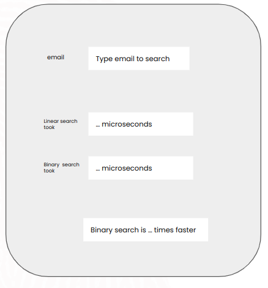

### Sorting Algorithms and Big O Session  
  
> The script demonstates how sorting algorithms can play a key role in building real world software. We explore binary search which relies on sorting to show how the efficiency and speed improves as compared to linear search. To sort the data we used the built-in sort method. We already learnt implementation of different sorting algorithms and wanted to have a test of how python simplifies this.  
  

### Next steps
Using Tkinter, create an interface for the script into something like...  
  

